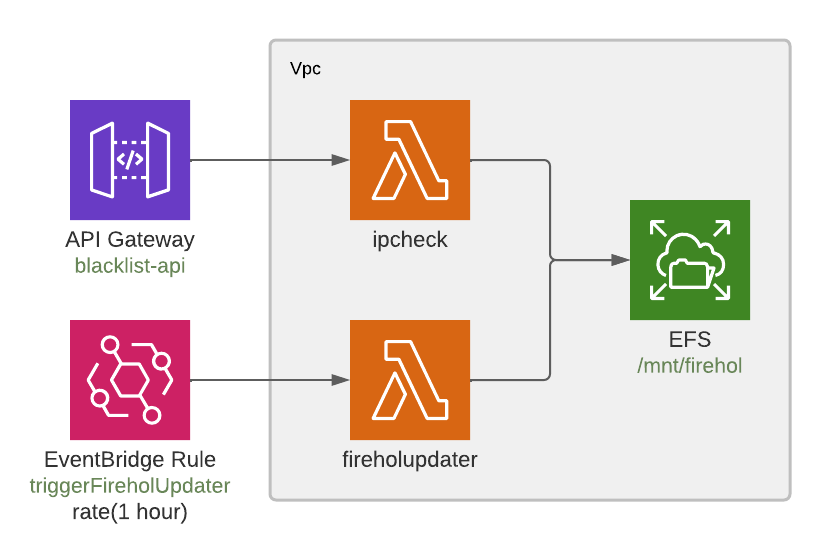

# Blocklist - IP Blocking Service

## Goals
Create a cloud native service in AWS:
* REST endpoint to check if a given IP should be blocked
* Auto-updating blocked IP service
  * Load a configured set of sources from the [Firehol repo](https://github.com/firehol/blocklist-ipsets) on GitHub

## Project structure
    
    ├── cdk                 # AWS CDK Infrastructure Code
    └── software            # Lambda Function Implementations
        ├── fireholupdater  # Refreshes the firehol IP list
        └── ipcheck         # REST endpoint that performs the check

## Architecture Overview


### Description
See each function's README for details:
* [Firehol Updater](./software/fireholupdater/README.md)
* [IP Check](./software/ipcheck/README.md)

## Prerequisites
- [AWS CDK](https://docs.aws.amazon.com/cdk/latest/guide/getting_started.html) 
- [docker](https://docs.docker.com/get-docker/) 
- AWS credential profile set up in ~/.aws/config

Example:

    [default]
    aws_region = us-east-1
    aws_access_key_id = <aws key>
    aws_secret_access_key = <aws secret>

## Building & Deploying 

- Go to cdk infrastructure folder
```bash
    cd cdk
```

- Create the cloudformation document
```bash
    cdk synth
```

- Deploy on AWS
```bash
    cdk deploy --profile default 
```
_Here we're using the `[default]` aws creds profile from `~/.aws/config` from the prerequisites section_

You'll be asked to confirm the deploy.  Then take a nice :coffee: break while CDK creates an AWS Stack
(BlocklistStack) with all required components, configuration, and dependencies. (~10 mins)

When finished take note of the `Outputs` section:
```bash
Outputs:
BlocklistStack.HttApi = https://<prefix>.execute-api.us-east-1.amazonaws.com
```
_Your url will have a different hash prefix_

## Testing
### Ensuring the fireholupdater lambda is run first:
Once the `fireholupdater` lambda is triggered and completes we should be able to test out the `ipblocker` endpoint.

By default the EventBridge Rule triggers `fireholupdater` once an hour, but usually fires 
within the first few minutes of being created.  If you're impatient you can either log into 
the AWS console, go to Lambdas, find the `fireholdupdater` lambda and test it directly.

Otherwise you can trigger it via the AWS CLI with something like this: 
```text
# list your lambdas and find the one whose name starts with "BlocklistStack-FireholUpdater..."
aws lambda list-functions

# use that name to trigger the lambda directly
aws lambda invoke --function-name BlocklistStack-FireholUpdater65549623-wo4z3z7wBhNp --payload '{}' response.json
```
### Checking IPs
Using the URL from the Outputs section above, we can start testing IPs:

_Note that which IPs are blocked or not-blocked depends on which ip datasets were configured to 
be included from the firehol list_

#### IP Blocked Example - returns 200 since it was found in the list
Note the "block" in the JSON response shows which IP block rule blocked the tested ip.
```bash
curl -i 'https://<prefix>.execute-api.us-east-1.amazonaws.com/blocklist?ip=24.236.0.0'
HTTP/2 200
date: Wed, 02 Mar 2022 02:34:16 GMT
content-type: application/json
content-length: 43
x-custom-header: application/json
apigw-requestid: OVaiUikooAMESMw=

{"block":"24.236.0.0/19","ip":"24.236.0.0"}%
```
#### IP Not Blocked Example - returns 404 not found
```bash
curl -i 'https://<prefix>.execute-api.us-east-1.amazonaws.com/blocklist?ip=1.2.0.0'                                                                                                                                                                                                                                                              main ✚ ✱ ◼
HTTP/2 404
date: Wed, 02 Mar 2022 02:37:59 GMT
content-type: application/json
content-length: 27
x-custom-header: application/json
apigw-requestid: OVbFQg-JoAMEStA=

{"block":"","ip":"1.2.0.0"}
```

## Clean up
Once you're done with BlockList tear the entire thing down to remove it from your AWS account:

```bash
cdk destroy --profile default
```

## Useful commands

 * `mvn package`     compile and run tests
 * `cdk ls`          list all stacks in the app
 * `cdk synth`       emits the synthesized CloudFormation template
 * `cdk deploy`      deploy this stack to your default AWS account/region
 * `cdk diff`        compare deployed stack with current state
 * `cdk docs`        open CDK documentation