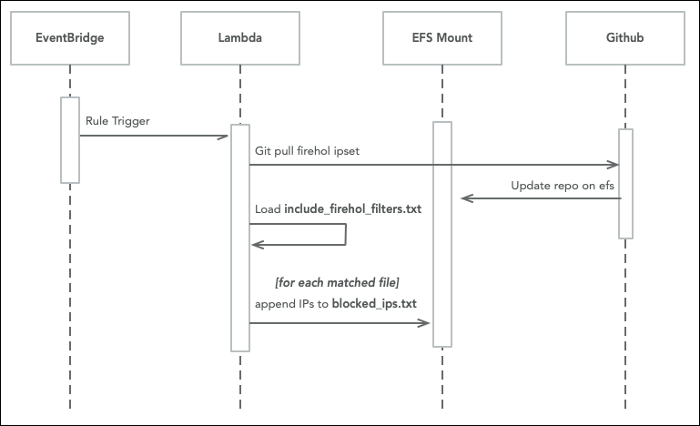

# Firehol Updater Lambda

## Purpose
This function's responsibility is to download the latest updates from 
the [Firehol repo](https://github.com/firehol/blocklist-ipsets) on GitHub and then create a
consolidated file output file of block-listed IPs for the `IP Check` lambda.

## Process 

On trigger from an EventBridge rule (or manual) this lambda:
* Clones or pulls the latest from firehol github repo
* Loads the configuration file `./resources/include_firehol_filters.txt`
* Walks the files in the repo folder, consolidating name matches to an EFS file named `/mnt/firehol/blocked_ips.txt`

## Inputs
None.

## Outputs 
EFS File: `/mnt/firehol/blocked_ips.txt`

# Improvements
* Externalize the `./resources/include_firehol_filters.txt` file to S3 for config without redeploy. 
* Add logic to consolidate the output file to reduce the line count
  * The larger this file is, the slower the cold startup of IP Check
  * CIDR Masks can replace a massive list of consecutive IPs
