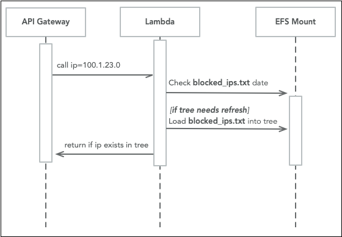

# IP Check Lambda

## Purpose
This function loads the most recent file from EFS mount `/mnt/firehol/blocked_ips.txt`
and parses it into a [Radix Tree](https://en.wikipedia.org/wiki/Radix_tree), which offers
very fast lookups.

This function expects to receive an IP number via an API Gateway document containing an 'ip' query parameter.

## Process

On trigger from API Gateway this lambda:
* Checks for the EFS file `blocked_ips.txt` existence and last modified date
* If cold start or file has been modified since last invocation:
  * Load the `blocked_ips.txt` into a tree
  * Store the tree and latest modification date
* pull query parameter "ip" value from API Gateway input
* Return:
  * 200 if the ip address exists in the table
  * 404 if the ip address does not exist in the table

## Benefits
* Because this is a simple lambda, it can scale out pretty easily
* All lambdas in the pool will update on the first invocation after the shared file is updated

## Improvements
The only major issue with this lambda is that the cold startup of the function can take a few seconds, 
where it must load the `blocked_ips.txt` file into a binary tree.

Possible ideas to speed this up: 
* Schedule the firehol update to happen at a low-peak time
* Have the Firehol Updater function try to reduce the number of lines in the file
by replacing large groups of consecutive IPs with a CIDR mask.
  * the smaller the file, the shorter the load time
* Another possibility is AWS Provisioned Concurrency, to keep a warm pool up and available.
* Consider a different backing store for the list of blocked IPs
  * Possibly DynamoDB or some other backing store external to the Lambda
  * Downside is slower warm lookup times but zero cold start time
